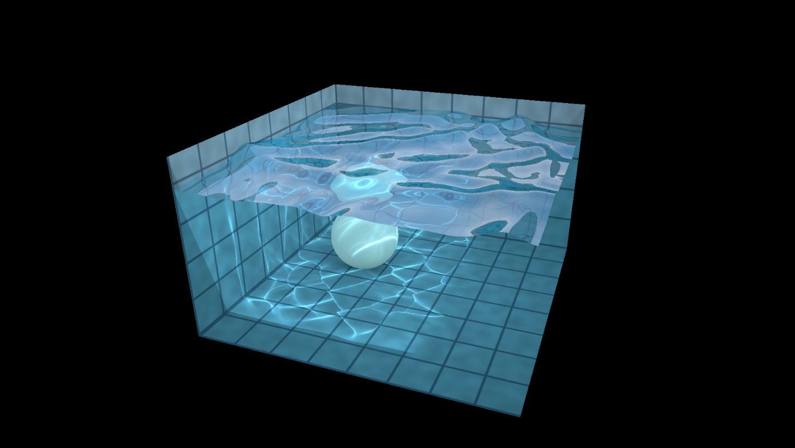

# WebGL Water — Unity 6 / URP Port

> **Original work by [Evan Wallace](https://madebyevan.com/webgl-water/).**
> This repository is a faithful **port** of his 2011 *WebGL Water* demo to
> Unity 6 + URP. All of the original ideas — the GPU heightfield simulation,
> the in-shader ray-traced reflection/refraction, the projected caustics and
> the blob/rim shadows — are his. Full credit and copyright for the original
> design and shaders belong to Evan Wallace; this port simply re-implements
> them in Unity. See the original: https://madebyevan.com/webgl-water/ and
> https://github.com/evanw/webgl-water

---



An interactive pool of water you can poke, ripple, and drop a ball into, with
real-time caustics on the floor — running entirely on the GPU inside Unity.

## Features

- **GPU heightfield simulation** — 256×256 ping-pong float texture driven by a
  compute shader (drop / wave-propagation / normal / sphere-displacement kernels).
- **In-shader ray tracing** — the water surface analytically reflects and
  refracts the pool, the ball, and a sky cubemap, exactly like the original.
- **Projected caustics** — the water grid is projected onto the floor to compute
  light focusing.
- **Blob & rim shadows** — the ball casts a soft shadow; the pool rim self-shadows.
- **Volume conservation** — the surface stays level no matter how hard you ripple it.
- **Reusable orbit camera** — drag to orbit, scroll to zoom.
- **Designer knobs** — wave speed, damping, sub-steps, ripple strength/radius,
  and reflection strength, all exposed in the inspector.
- **Self-contained** — a one-click editor menu builds the whole scene, including
  a procedural sky cubemap and a fallback tile texture.

## Requirements

- **Unity 6** (developed on `6000.3.9f1`).
- **Universal Render Pipeline** (`17.3.0`).
- A GPU that supports **compute shaders** and **RGBAFloat** random-write
  textures (any modern desktop/console GPU; GLES3.1+/Metal/Vulkan on mobile).

## Quick start

1. Open the project in Unity 6 and let it import (no console errors expected).
2. Menu **Tools ▸ WebGL Water**:
   - **Build Scene (water only — keep my pool)** if you've already built a pool.
   - **Build Scene (with analytic pool)** for the original look out of the box
     (includes a procedurally textured pool that receives the caustics).
3. Press **Play**.

The builder generates the meshes, materials, a procedural sky cubemap and a
fallback tile texture under `Assets/WebGLWater/Generated/`, and wires up the
camera and the `Water Controller`.

## Controls

| Action | Result |
| --- | --- |
| Drag on the water | Make ripples |
| Drag the ball | Move it and displace water |
| Drag the background | Orbit the camera |
| Scroll wheel | Zoom |
| **Space** | Pause / resume the simulation |
| **G** | Toggle ball gravity / physics |
| **L** (hold) | Point the light along the camera view |

## Tuning (Water Controller inspector)

| Knob | Effect |
| --- | --- |
| **Wave Speed** (0.1–2.0) | Propagation stiffness. Higher = faster, livelier waves (stable up to ~2.0). |
| **Damping** (0.90–1.0) | How quickly ripples fade. Lower = choppier; toward 1.0 = glassy. |
| **Steps Per Frame** (1–8) | Simulation sub-steps. More = faster, smoother propagation. |
| **Ripple Strength / Radius** | Size and intensity of a click/drag ripple. |
| **Conserve Volume** | Keeps the surface from drifting up/down as ripples are added. |
| **Reflection Strength** (0–1) | On the water materials. 1 = original Fresnel; 0 = fully see-through. |

> Presets — *calm pond:* waveSpeed ~1.0, damping ~0.99, steps 2.
> *energetic:* waveSpeed 2.0, damping 0.997, steps 3–4, higher ripple strength.

## Using your own pool

The water surface ray-traces an **analytic** pool defined in normalized space:
floor at `y = -1`, walls up to `y = 2/12`, spanning `x,z ∈ [-1, 1]` (1 unit = the
demo's unit). For your own pool's reflections to match, keep it at those
dimensions and assign your tile texture to **Water Controller ▸ Tiles**.

## How it maps to the original

| Original (`evanw/webgl-water`) | This port |
| --- | --- |
| `water.js` | `WaterSim.compute` + `WaterSimulation.cs` |
| `renderer.js` helper functions | `WaterCommon.hlsl` |
| water / cube / sphere shaders | `WaterSurface` / `PoolWall` / `WaterSphere` shaders |
| `updateCaustics` | `Caustics.shader` drawn into a 1024² RT via a CommandBuffer |
| `main.js` (input, camera, physics) | `WaterController.cs` + `OrbitCamera.cs` |

There's a more detailed developer guide in
[`Assets/WebGLWater/README.md`](Assets/WebGLWater/README.md), including the few
in-editor tweaks you may need (face-culling direction, caustic Y-flip, color space).

## Known limitations

It's a **contained, heightfield** water — great for pools, ponds and fountains,
not oceans. It simulates vertical displacement only (no breaking waves/splashes),
covers a single bounded body of water, and its reflections see only the cubemap +
analytic pool + the one ball (not arbitrary scene geometry). The simulation lives
on the GPU, so gameplay interaction (buoyancy, floating objects) needs an
`AsyncGPUReadback` of the height texture. See the developer guide for the full list.

## Credits & License

- **Original concept, design and GLSL shaders:** © 2011 **Evan Wallace** —
  https://madebyevan.com/webgl-water/ — released under the **MIT License**.
- **Unity 6 / URP port:** this repository, also released under the **MIT License**.

This port is provided in the same spirit as the original. If you use it, please
keep the credit to Evan Wallace for the original work.

```
MIT License

Copyright (c) 2011 Evan Wallace (original WebGL Water)
Copyright (c) 2026 (Unity 6 / URP port)

Permission is hereby granted, free of charge, to any person obtaining a copy
of this software and associated documentation files (the "Software"), to deal
in the Software without restriction, including without limitation the rights
to use, copy, modify, merge, publish, distribute, sublicense, and/or sell
copies of the Software, and to permit persons to whom the Software is
furnished to do so, subject to the following conditions:

The above copyright notice and this permission notice shall be included in all
copies or substantial portions of the Software.

THE SOFTWARE IS PROVIDED "AS IS", WITHOUT WARRANTY OF ANY KIND, EXPRESS OR
IMPLIED, INCLUDING BUT NOT LIMITED TO THE WARRANTIES OF MERCHANTABILITY,
FITNESS FOR A PARTICULAR PURPOSE AND NONINFRINGEMENT. IN NO EVENT SHALL THE
AUTHORS OR COPYRIGHT HOLDERS BE LIABLE FOR ANY CLAIM, DAMAGES OR OTHER
LIABILITY, WHETHER IN AN ACTION OF CONTRACT, TORT OR OTHERWISE, ARISING FROM,
OUT OF OR IN CONNECTION WITH THE SOFTWARE OR THE USE OR OTHER DEALINGS IN THE
SOFTWARE.
```
